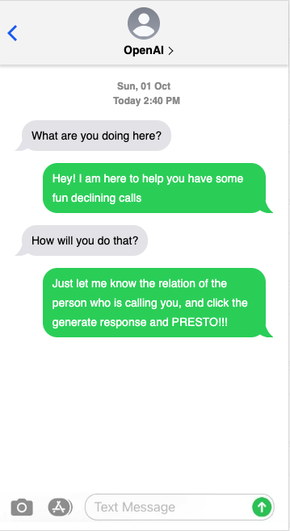
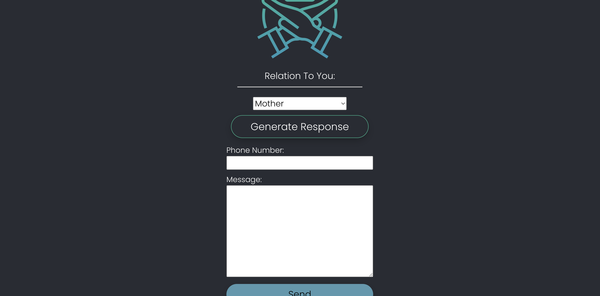

<u>SMS AI Generator</u>

## Description:
This is a React application that utilizes Open AI's API, and Trilio's API to generate a random text to someone who is calling(Poen AI), and send it(Twilio), so you can have some fun while filtering calls.

## Using the App

- Get a call from someone you either don't want to speak to, or do not have time to speak with.

- Load the app on your browser.

- Select their relation to you (Someone You Dislike, Acquaintance, Friend, Significant Other, Mother, Father, Sister, Brother)

- Click the "Generate Text" button to send them a hilarious text that is AI generated!

- Put the number in you want to send the text to.

- Send it!!

